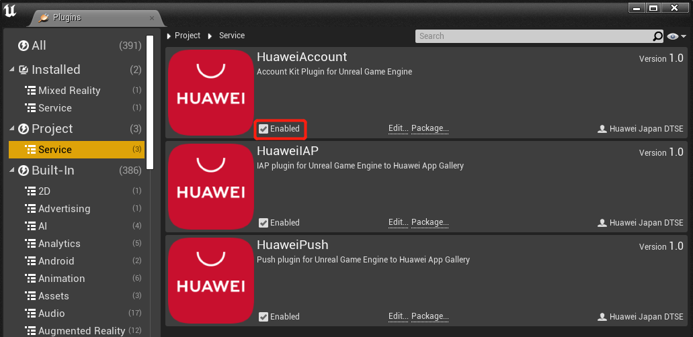
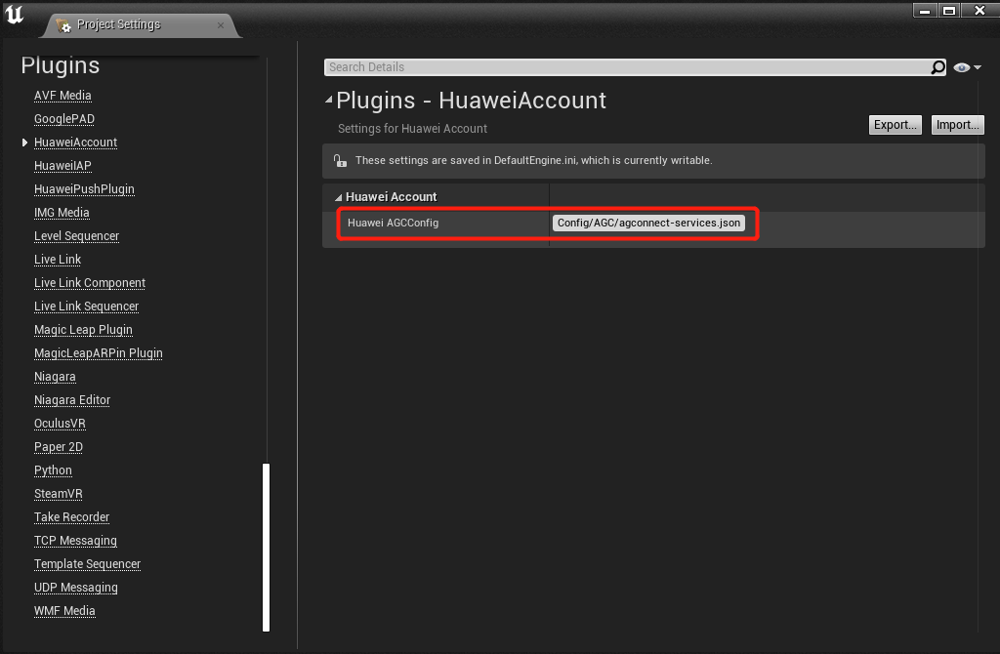

# Account Kit (HMS)

## Service Introduction

Account Kit provides you with simple, secure, and quick sign-in and authorization functions. Instead of entering accounts and passwords and waiting for authentication, users can just tap the **Sign in with HUAWEI ID** button to quickly and securely sign in to your app with their HUAWEI IDs.

### Supported Devices
<table>
  <thead>
      <tr>
          <th>Platform</th>
          <th>Device Type</th>
          <th>OS version</th>
          <th>HMS Core(APK) version</th>
      </tr>
  </thead>
  <tbody>
      <tr>
          <td>Android</td>
          <td>Phone, tablet, HUAWEI Vision, and telematics device</td>
          <td>EMUI 3.0 or later, Android 4.4 or later</td>
          <td>4.0.0.300 or later</td>
      </tr>
      <tr>
          <td rowspan=3>HarmonyOS (Java)</td>
          <td>Phone and tablet</td>
          <td>HarmonyOS 2.0 or later</td>
          <td>5.0.0.300 or later</td>
      </tr>
      <tr>
          <td>Telematics device</td>
          <td>HarmonyOS 2.0 or later</td>
          <td>6.2.0.300 or later</td>
      </tr>
      <tr>
          <td>HUAWEI Vision and smart watch</td>
          <td>HarmonyOS 2.0 or later</td>
          <td>6.5.0.300 or later</td>
      </tr>
      <tr>
          <td rowspan=3>HarmonyOS (JavaScript)</td>
          <td>Phone and tablet</td>
          <td>HarmonyOS 2.0 or later</td>
          <td>5.0.0.300 or later</td>
      </tr>
      <tr>
          <td>Telematics device</td>
          <td>HarmonyOS 2.0 or later</td>
          <td>6.2.0.300 or later</td>
      </tr>
      <tr>
          <td>HUAWEI Vision and smart watch</td>
          <td>HarmonyOS 2.0 or later</td>
          <td>6.5.0.300 or later</td>
      </tr>
  </tbody>
</table>

### Supported Locations and Languages

Serves [more than 190 countries and regions](https://developer.huawei.com/consumer/en/doc/development/HMSCore-Guides/supported-regions-0000001050048968), and supports [more than 70 languages](https://developer.huawei.com/consumer/en/doc/development/hmscore-common-Guides/support-language-0000001050040564).

### Service Features

- Quick and standard<br>
Connects your app to the Huawei ecosystem, allowing users to sign in to your app with their HUAWEI IDs from a range of devices, such as phones, tablets, HUAWEI Vision products, and telematics devices.

- Secure, reliable, and compliant with international standards<br>
Complies with GDPR and industry-standard protocols such as [OAuth 2.0](https://oauth.net/2/) and [OpenID Connect](https://openid.net/connect/); supports two-factor authentication (password plus verification code) to ensure high security; notifies users of possible risks in real time.

### Use Cases

#### Quick Sign-In to Apps
Users can quickly and conveniently sign in to apps with their HUAWEI IDs. When signing in to an app using a HUAWEI ID for the first time, a user needs to authorize the app. Then, the user can sign in to the app with one tap. With one HUAWEI ID, a user can sign in to all apps on all devices.


#### Sign-In Using QR Code
With Account Kit, the user who has already signed in with his/her HUAWEI ID on a device can easily sign in with the same ID on other devices by scanning a QR code.


### Privacy Statement
Before integrating Account Kit into your app, you will need to sign the [HUAWEI Developers Service Agreement](https://developer.huawei.com/consumer/en/doc/start/agreement-0000001052728169) and [Agreement on Use of Huawei APIs](https://developer.huawei.com/consumer/en/doc/distribution/app/10129). You understand and accept that downloading or using the said kit will be deemed as you having agreed to all of the preceding agreements, and you will fulfill and assume the legal responsibilities and obligations in accordance with said agreements.

## Integrating into Your Unreal Project

### Register and get verified

Before you get started, you must register as a HUAWEI developer and complete identity verification on the [HUAWEI Developer website](https://developer.huawei.com/consumer/en). For details, please refer to [Register a HUAWEI ID](https://developer.huawei.com/consumer/en/doc/10104).


### Create an app
Create an app by referring to [Creating a Project](https://developer.huawei.com/consumer/en/doc/development/AppGallery-connect-Guides/agc-get-started#createproject) and [Creating an App in the Project](https://developer.huawei.com/consumer/en/doc/development/AppGallery-connect-Guides/agc-get-started#createapp). Set the following parameters as described:
- Platform: Select Android
- Device: Select Mobile phone
- App category: Select App or Game


### Prepare for development

According to [HMS integration process introduction](https://developer.huawei.com/consumer/en/codelab/HMSPreparation/index.html#6), we still need to add some configurations to the gradle files for development preparations.


1. Install the Plugin

   Copy and enable the Unreal Engine Plugin.

   If a `<unreal_project_directory>/Plugins` folder does not exist, create it.

   From the Huawei Account Unreal plugin, copy the HuaweiAccount folder and its contents to `<unreal_project_directory>/Plugins`.
   

   From your Unreal Editor, select **Edit -> Plugins** menu then enable the Huawei Account Plugin.
   

2. Signing Certificate Fingerprint

   Please refer to Huawei [preparation documentation step 4](https://developer.huawei.com/consumer/en/codelab/HMSPreparation/index.html#3) for generating a SHA256 Certificate Fingerprint.

   

   And refer to Huawei [preparation documentation step 5](https://developer.huawei.com/consumer/en/codelab/HMSPreparation/index.html#4) to add Fingerprint to AppGallery Connect.

   

3. Package name

   Set the package name in **Edit -> Project Settings -> Android -> APK Packaging -> Android Package Name**

   The package name is `com.${Company Name}.${Product Name}`.

   You can also complete the rest of the settings here, such as version number, icons, resolution, etc. 

   

4. Set up plugin

   - Sign in to [AppGallery Connect](https://developer.huawei.com/consumer/en/service/josp/agc/index.html) and click **My projects**.
   - Find your app project and click the app that needs to integrate the HMS Core SDK.
   - Go to **Project settings > General information**. In the App information area, download the `agconnect-services.json` file.
   
   - You can put the json file under `<unreal_project_directory>/Configs/AGC` as default (create the `Configs/AGC` directory if not existed) or in your own favorite path
   - In your Unreal Editor, select **Edit -> Project Settings -> Plugins -> HuaweiAccount** then set up the `agconnect-services.json` file path
   


## Developing with the SDK

### Developing

#### Using Blueprint
The below functions are supported with Blueprint
- `loginWithoutVerification`
- `loginWithIdToken`
- `loginWithAuthorizationCode`
- `logOut`
- `cancelAuthorization`
You can refer to the [Blueprint sample](Blueprint/HuaweiAccount.uasset).


#### Using C++ APIs
Access the Huawei Account APIs by including the header file `Account.h` in the related classes of your project.

```C++
#include "Account.h"
```

- Log in without identity verification 

```C++
huawei::Account::loginWithoutVerification();
```
- Log in via ID Token(OpenID connect)

Sample code
```C++
huawei::Account::loginWithIdToken();
```

- Log in via Authorization Code(OAuth 2.0)

Sample code
```C++
huawei::Account::loginWithAuthorizationCode();
```
- Log out

Sample code
```C++
huawei::Account::logOut();
```

- Cancel authorization

Sample code
```C++
huawei::Account::cancelAuthorization();
```

- Listen to callback events
Implement a listener class to receive information in all the Account callback events

Action types table:
|<div style="width:80px">Type</div>                       | Description                | 
  | ------------------------------------------------------------ | ----------------------- |
  | LOGIN_ACTION | Login without ID verification |
  | LOGIN_BY_ID_TOKEN_ACTION | Login via ID token(OpenID connect) |
  | LOGIN_BY_AUTH_CODE_ACTION | Login via Authorization Code(OAuth 2.0) |
  | LOGOUT_ACTION | Logout |
  | CANCEL_AUTH_ACTION | Cancel authorization |

Sample code
Header file
```C++
class YourAccountListener : public huawei::AccountListener {
public:
    YourAccountListener();
    
    void onLoggedIn(const AccountInfo account);
    void onGetIdToken(const FString idToken, const AccountInfo account);
    void onGetAuthCode(const FString authCode, const AccountInfo account);
    void onLoggedOut();
    void onCancelledAuth();
    void onException(int action, const FString message);
}  
```

Then set it with the `setListener` API

Sample code
```C++
huawei::Account::setListener(new YourAccountListener());
```

You can get the below account information
|<div style="width:80px">Type</div>                       | Description                | 
  | ------------------------------------------------------------ | ----------------------- |
  | displayName | user's nickname |
  | avatarUriString | user's profile picture URI |
  | email | user's email address if user authorizes, otherwise **null** will be returned  |
  | openId | user's openID (identifies a user in a app) |
  | unionId | user's unionID (identifies a user accross all your apps) |

If you use `loginWithIdToken` API, you have to verify the obtained **ID token** on your server. Please refer to [this guide](https://developer.huawei.com/consumer/en/doc/development/HMSCore-Guides/android-scenario-id-token-0000001116078504#:~:text=Method%202%3A%20Server%2Dside%20verification%20(recommended)) for more detailed.

If you use `loginWithAuthorizationCode` API, you have to verify the obtained **Authorization code** on your server. Please refer to [this guide](https://developer.huawei.com/consumer/en/doc/development/HMSCore-Guides/android-scenario-auth-code-0000001115918596#:~:text=Server%2DSide%20Development) for more detailed.

### Test & Release

Please refer to Huawei [integration procedure](https://developer.huawei.com/consumer/en/doc/start/htiHMSCore) for testing and releasing.


